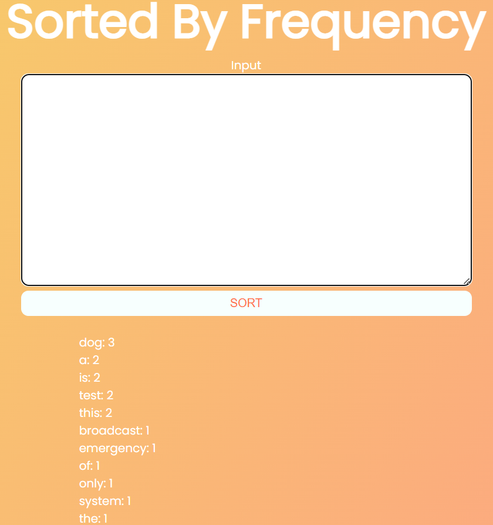

# Sorting by Frequency
Web App to process text and output a list ordered primarily by frequency of the words, and secondarily by lexicographic order when frequency is tied. As a constraint, this app attempts to avoid built-in sorting utils. A custom implementation of [Binary Search](https://en.wikipedia.org/wiki/Binary_search_algorithm) and [Bisect](https://en.wikipedia.org/wiki/Bisection_(software_engineering)) algorithms are used in tandem with a word dictionary/hash map to maintain the sorted order of the output list as new items are added.

You can view a working demo [here](https://sorting-by-frequency.herokuapp.com/).

The demo runs with the backend and the client being served on the same domain. Code for the demo varies in `server/index.js` as well as `components/Form.js` in `client/` (in comparison to [main](https://github.com/andrew-d-gordon/sorting_by_frequency/tree/main)). These changes are present in the [herokuServerClient](https://github.com/andrew-d-gordon/sorting_by_frequency/tree/herokuServerClient) branch.

# Example Run

To start the server and client separately, follow the below steps:
- **Starting server:** Enter `server/` in your terminal and run `npm install` and `npm start`.
  - The server will be spun up by default on port 3001 (url follows as `http://localhost:3001/`)
  - Primary route utilized for processing words is `/api/processWords` (to hit this route utilize `http://localhost:3001/api/processWords`, example shown in client's [`Form.js`](client/sorting_by_frequency/src/components/Form.js) at the `processWordsRequest` function)
- **Starting client:** Enter `client/sorting_by_frequency/` in your terminal and run `npm install` and `npm start`. After these commands, you should be automatically directed to `http://localhost:3000` in your preferred browser (if not can manually go to said url in browser).

App running with [docs/tests/test1](docs/tests/test1) as input.

Contents of [docs/tests/test1](docs/tests/test1): 

`this is a test of the emergency broadcast system this is only a test dog dog dog`

Output on client (after above input provided and pressing `COMPUTE FREQUENCY SORT` button):

