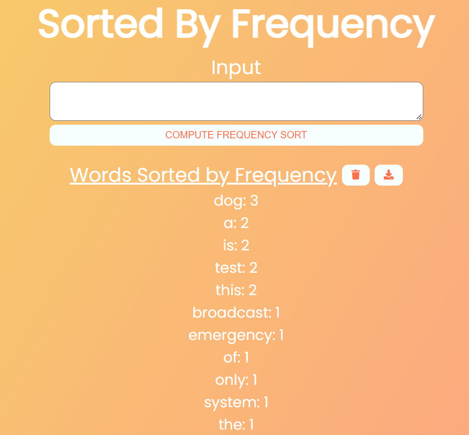

# Sorting by Frequency
Web App to process text and output a list ordered primarily by frequency of the words, and lexicographic order when frequency is tied. Attempts to avoid built-in sorting utils for practice.

Current development hosts primary algorithmic functionality on the client-side, soon this will be isolated to a back end server that serves the client.

# Example Run

App running with [docs/tests/test1](docs/tests/test1) as input.

Contents of [docs/tests/test1](docs/tests/test1): 

`this is a test of the emergency broadcast system this is only a test dog dog dog`

Output on client (after inputting and pressing `SORT` button):

